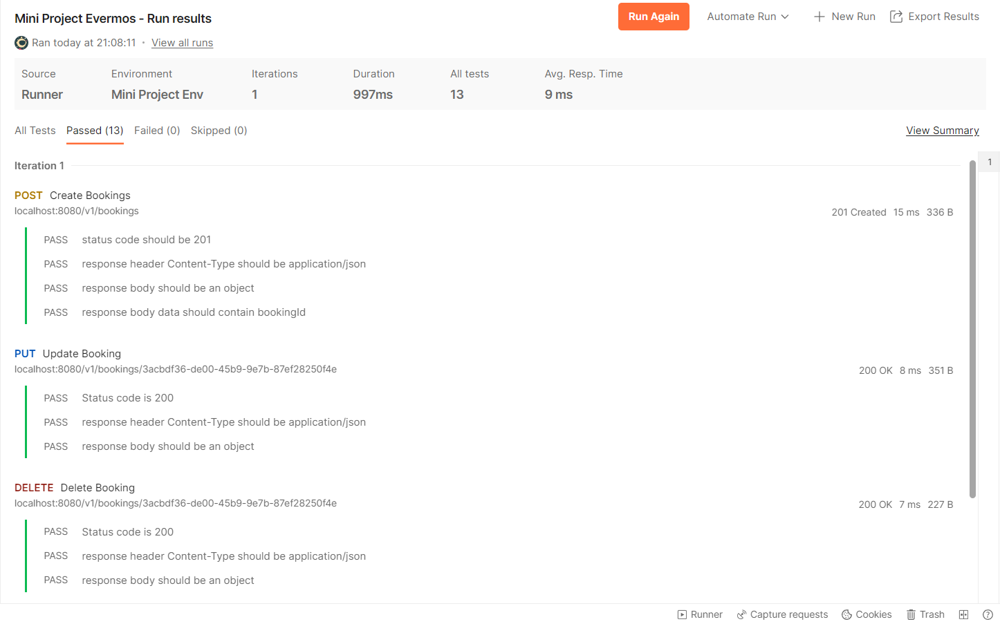

# mini-project
bootcamp evermos REST API

## How To Run
1. get all dependencies defined in go.mod file in terminal
```
go get -t -u ./...
```
2. Configure Database Connecion, you can find this on internal/database/service.go. you will findout connection function like this
```
func Connect() (*sql.DB, error) {
	db, err := sql.Open("mysql", "<username>:<password>@tcp(127.0.0.1:<mysqlserverport>)/<databasename>")
	if err != nil {
		return nil, err
	}

	return db, nil
}
```
best practice is using .env file. ensure your confidential didnt get public   

3. run the server with in the root directory
```
go run main.go
```


## Documentation 
### Postman Collection Run 


to import documentation you can use 
1. Mini Project Env.postman_environment.json
2. Mini Project Evermos.postman_collection.json

on this root project and import it to postman 


made by : Muhammad Tamiramin Hayat Suhendar